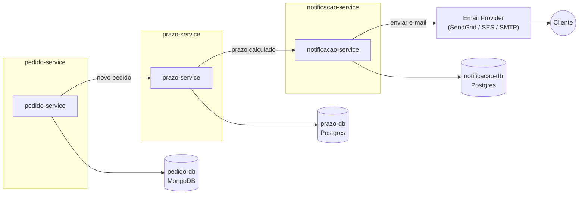

# Distributed Logistics System - Pedido Service

Objetivo

Simular um sistema distribuído de logística com microservices, filas e streaming de eventos, focando em resiliência e integração de bancos diferentes.

Tecnologias

Java 21+, Spring Boot 3+

Kafka ou RabbitMQ

MongoDB + PostgreSQL

Docker Compose

Testcontainers para testes automatizados

Arquitetura e Microservices
1️⃣ Pedidos Service

Função: Cria pedidos de entrega e publica eventos de novos pedidos.
Endpoints REST:

POST /orders → cria um novo pedido (JSON com id, origem, destino, itens)

GET /orders/{id} → busca pedido por ID

Banco: PostgreSQL (para persistência de pedidos)
Eventos: Publica mensagem no Kafka/RabbitMQ para cálculo de prazo

